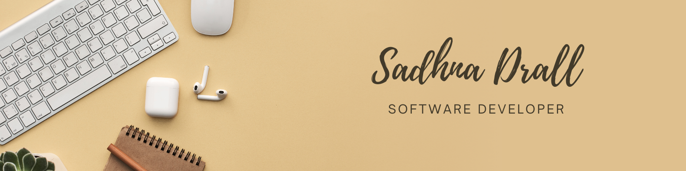

# Sadhna Drall

Welcome to my personal repository! This is a space where I document my journey, projects, hobbies, and interests. Explore the sections below to learn more about me.

---

## 🧑‍💻 About Me  
Hi, I'm **Sadhna Drall**, a third-year **Computer Science** student pursuing my Bachelor's degree in Computer Science. My academic journey has equipped me with a strong foundation in programming, data analysis, and software development. I'm passionate about leveraging technology to solve real-world problems and am constantly exploring new areas in data science, artificial intelligence, and web development.  

In addition to my technical skills, I enjoy collaborating on projects, learning cutting-edge technologies, and sharing my knowledge to contribute meaningfully to the tech community.  

## 🌟 Skills and Technologies  
- **Programming Languages:** Python, Java, JavaScript, SQL  
- **Frameworks & Tools:** React, Tailwind CSS, Jakarta EE, pgModeler, GlassFish  
- **Technological Expertise:** REST APIs, data visualization, database modeling, software development  
- **Other Skills:** Analytical thinking, creative problem-solving, collaboration, and effective communication  

---

## 🚀 Projects
Here are some of the projects I’ve worked on:

- **Web Chat Server:** A real-time chat application built using WebSockets and Java.
- **Spam Detector:** A spam email classification tool using machine learning.
- **Sky Inventorium:** Designed an architectural diagram for a point-of-sale system using Azure.

For more projects, check out my [GitHub profile](https://github.com/QuantumSadhna).

---

## 🎨 Hobbies
I love exploring creative pursuits in my free time. Some of my hobbies include:  
- 🌍 **Travelling**  
- 🖋️ **Writing**  
- 📚 **Reading**  
---

## 📫 Contact Me  
Feel free to reach out via email or connect with me on LinkedIn:  
- 📧 Email: [sadhnadrall232003@gmail.com](mailto:sadhnadrall232003@gmail.com)  
- 💼 LinkedIn: [Sadhna Drall]((https://www.linkedin.com/in/sadhna-drall/))  

---

**Thank you for visiting my repository! Feel free to explore and connect.**
